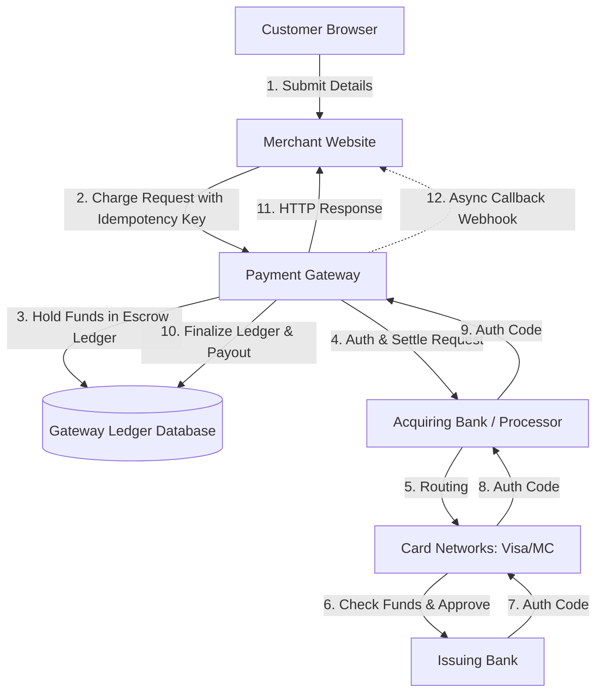
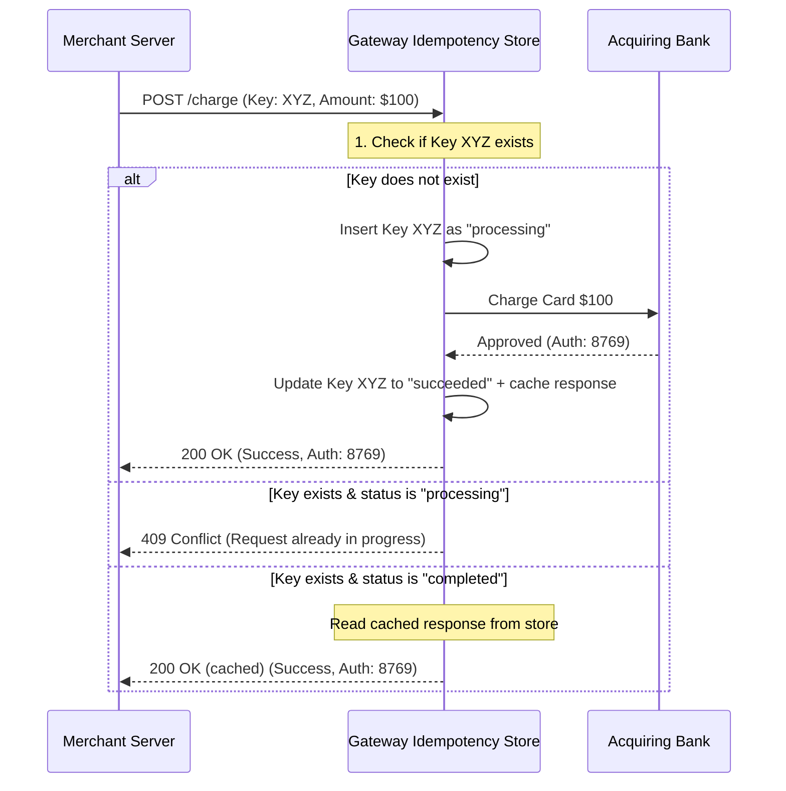

# Payment Gateway System Design

Welcome to the **Payment Gateway System Design Playground**. This document explains the primary engineering patterns, architectural trade-offs, and critical system designs that power modern transaction networks (like Stripe, Adyen, and PayPal).

---

## 1. High-Level Payment Topology

When a customer pays for an item online, the transaction flows through multiple nodes in a highly distributed system:



---

## 2. The Idempotency Engine

### The Problem: Network Failures
HTTP is an unreliable protocol. A request to charge a customer can fail in three ways:
1. **Request Lost**: The request never reaches the Payment Gateway. (Safe to retry)
2. **Gateway Crashes / Times out**: The gateway starts processing the charge, but the connection drops before a response is returned. (Indeterminate)
3. **Response Lost**: The charge succeeds, but the network drops before the customer receives the confirmation. (Retrying without protection results in a **double charge**).

### The Solution: Idempotency Keys
An **Idempotency Key** is a unique identifier (usually a UUID v4) generated by the merchant's server for a specific client checkout session.



### Critical Edge Case: Concurrent Requests
If a customer clicks "Pay" twice in rapid succession, both requests might hit the server simultaneously. The server must use an atomic lock (or record creation constraint) to register the key. 
* If a duplicate request arrives while the original is still running, the gateway returns **`409 Conflict`** instead of processing it again.

---

## 3. Double-Entry Bookkeeping Ledger

### Why Simple Balances Fail
In a naive banking application, you might update account balances like this:
```sql
UPDATE accounts SET balance = balance - 100 WHERE id = 'customer';
UPDATE accounts SET balance = balance + 100 WHERE id = 'merchant';
```
This design is **unacceptable** in financial engineering:
1. **No Audit Trail**: If a balance changes, there is no history of *why* it changed.
2. **Race Conditions**: Parallel updates can overwrite each other (lost updates).
3. **Data Integrity**: If the database crashes mid-way, money is created or destroyed.

### The Ledger Pattern
In a double-entry ledger, **money is never mutated directly; it is only moved**. 
* Every transaction consists of an immutable **ledger entry** with at least one **debit** (source) and one **credit** (destination).
* **Conserving Mass**: The sum of all accounts in the ledger is always equal to a constant. Credits = Debits.
* Account balances are calculated dynamically by aggregating ledger logs: `Balance = Sum(Credits) - Sum(Debits)`.

### Our Playground's Ledger Flow
1. **Hold Phase (Pending Authorization)**:
   We immediately move the charge amount from the Customer to the Gateway's internal escrow:
   * **Debit**: `customer` ($100.00)
   * **Credit**: `bank_reserve` ($100.00) (Simulates placing hold on customer funds via bank)
2. **Settlement Phase (Success)**:
   Once the card processor approves, the gateway distributes the funds, taking a **2% transaction fee**:
   * **Debit**: `bank_reserve` ($98.00) $\rightarrow$ **Credit**: `merchant` ($98.00)
   * **Debit**: `bank_reserve` ($2.00) $\rightarrow$ **Credit**: `gateway_fees` ($2.00)
3. **Release Phase (Failure/Decline)**:
   If the transaction is declined, the hold is released:
   * **Debit**: `bank_reserve` ($100.00) $\rightarrow$ **Credit**: `customer` ($100.00)

---

## 4. Indeterminate State & Reconciliation

### The Network Black Hole
What happens if the Acquiring Bank API hangs and times out?
The Gateway must return a response to the Merchant, but it does not know if the customer's card was charged or not.

> [!WARNING]
> In an indeterminate state, the gateway **MUST NOT** release the customer's funds automatically, nor should it retry the bank blindly.

### The Solution: Reconciliation
To resolve indeterminate transactions, the system runs an asynchronous **Reconciliation Job**:
1. It fetches the bank's internal ledger (the bank statement).
2. It compares it against the gateway's pending/indeterminate transactions.
3. If the bank shows a success record, the gateway settles the transaction in its ledger.
4. If the bank has no record of the transaction, the gateway cancels it and safely refunds the customer's hold.

---

## 5. Reliable Asynchronous Webhooks

### The Problem: Merchant Downtime
Once a transaction is finalized (either immediately or after a reconciliation job), the gateway must notify the merchant. However, the merchant's server may be experiencing a temporary outage.

### The Solution: Queue with Exponential Backoff
To guarantee **at-least-once delivery** of notifications, the gateway implements a Webhook Queue:
1. Create a webhook payload and append it to an active queue.
2. Attempt delivery. If the merchant returns `200 OK`, mark it as delivered and remove it from the queue.
3. If delivery fails (e.g. `500 Server Error` or Timeout), calculate a delay using **Exponential Backoff**:
   $$\text{Delay} = 2^{\text{attempt}} \times \text{Base Delay}$$
   * Attempt 1: 4 seconds
   * Attempt 2: 8 seconds
   * Attempt 3: 16 seconds
   * Attempt 4: 32 seconds
4. Retry until delivery succeeds or the maximum retry limit (5) is reached.
